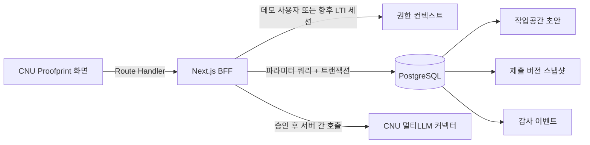

# CNU Proofprint 백엔드 구현 현황과 확장 설계

작성일: 2026-08-25
상태: 로컬 파일럿 백엔드 구현 완료, CNU LTI/SSO 연동 전

## 1. 현재 구현된 범위

프런트엔드의 `localStorage` 모의 저장을 제거하고 Next.js Route Handler와 PostgreSQL을 연결했다.

| 영역 | 현재 구현 |
| --- | --- |
| Web/BFF | Next.js 16 App Router, Node.js runtime |
| 데이터베이스 | PostgreSQL 14, 마이그레이션·시드 스크립트 |
| 인증 | 명시적인 로컬 데모 사용자. 임의 HTTP 헤더는 신뢰하지 않음 |
| 작업공간 | 목표, AI 사용 목적·요약, 판단, 성찰을 하나의 트랜잭션으로 저장 |
| 동시 편집 | `revision` 기반 낙관적 잠금, 오래된 저장은 HTTP 409 |
| 공개 범위 | 목적·판단·성찰을 학생이 선택, 원문은 서버에서도 공개 불가 |
| 제출 | 제출 시 JSON 스냅샷, 버전 번호, SHA-256 체크섬 생성 |
| 감사 | 저장, 공개 범위 변경, 제출 이벤트 기록 |
| 이력 | 작성 중·제출 완료 작업공간을 DB에서 조회 |
| 과제 내 AI | 모델 선택·질문·스트리밍 답변·학생 선택을 지원하는 데모/학교 커넥터 경계 |

현재 제출 버튼은 Proofprint 내부 제출본을 생성한다. 아직 CNU 사이버캠퍼스 과제함으로 파일이나 점수를 전송하지 않는다. 이 부분은 LTI 1.3 지원 여부를 학교와 확인한 뒤 연결한다.

## 2. 로컬 실행 방식

현재 개발 환경은 Docker가 아니라 Mac에 설치된 네이티브 PostgreSQL을 사용한다. 확인 당시 Docker 데몬이 실행 중이지 않았고, 로컬에 사용 가능한 PostgreSQL 14가 있어 파일럿을 그 방식으로 구성했다.

- 주소: `127.0.0.1:55432`
- 데이터베이스: `cnu_proofprint`
- 데이터 디렉터리: `frontend/.data/postgres`
- 연결 설정: `frontend/.env.local`의 `DATABASE_URL`
- 데이터 디렉터리와 실제 환경 변수는 Git에서 제외

```bash
cd frontend
npm install
npm run db:setup   # 시작 + 마이그레이션 + 시드
npm run dev
```

개별 명령은 다음과 같다.

```bash
npm run db:start
npm run db:status
npm run db:migrate
npm run db:seed
npm run db:stop
```

애플리케이션은 `DATABASE_URL`만 사용하므로 Docker PostgreSQL, 관리형 PostgreSQL, 학교 승인 DB로 이동할 때 비즈니스 코드를 바꿀 필요가 없다. Docker 구성이 필요해지면 같은 포트·DB 이름을 가진 Compose 파일을 추가하거나 연결 문자열만 교체하면 된다.

## 3. 요청 흐름



브라우저는 DB에 직접 접근하지 않는다. 서버가 `tenant → user → workspace owner`를 확인한 후에만 읽고 쓴다.

## 4. 실제 API

| 메서드 | 경로 | 역할 |
| --- | --- | --- |
| `GET` | `/api/health` | DB 연결과 인증 모드 확인 |
| `GET` | `/api/assignments/:slug/workspace` | 로그인 학생의 과제 작업공간 조회 |
| `PATCH` | `/api/workspaces/:workspaceId` | 전체 초안과 현재 단계 저장 |
| `PATCH` | `/api/workspaces/:workspaceId/disclosure` | 공개 범위 저장 |
| `POST` | `/api/workspaces/:workspaceId/submit` | 버전 스냅샷 생성 및 제출 상태 전환 |
| `GET` | `/api/proofprints` | 학생의 작성·제출 이력 조회 |
| `POST` | `/api/ai/assist` | 작업공간 권한 확인 후 데모 또는 CNU 멀티LLM 답변 스트리밍 |

변경 요청은 현재 `revision`을 함께 보낸다. 서버의 값과 다르면 `revision_conflict`와 HTTP 409를 반환해 다른 탭의 최신 내용을 조용히 덮어쓰지 않는다. 모든 응답은 개인 학습 데이터 캐시를 막기 위해 `Cache-Control: no-store`를 사용한다.

## 5. 데이터 모델

| 테이블 | 용도 |
| --- | --- |
| `tenants` | 학교 단위 데이터·보존 정책 |
| `users` | 학교 또는 LTI 외부 식별자와 역할 |
| `courses`, `memberships` | 과목과 수강 권한 |
| `assignments` | 과제, 학습목표, AI 활용 정책 |
| `workspaces` | 학생별 과제 상태, 현재 단계, `revision` |
| `learning_goals` | 교수자·개인 학습목표 |
| `ai_uses` | AI 사용 목적, 질문·제안 요약, 제공자·모델·요청 근거 |
| `decision_checkpoints` | 채택·수정·폐기와 판단 이유 |
| `reflections` | 배운 점, 생각 변화, 남은 질문 |
| `disclosure_settings` | 학생이 선택한 공개 범위 |
| `proofprint_versions` | 제출 시점 JSON, 버전, 체크섬 |
| `audit_events` | 저장·공개 변경·제출 감사 기록 |

모든 주요 PK는 `bigint generated always as identity`, 시각은 `timestamptz`를 사용한다. 외래키 검색 경로와 학생별 상태 조회에는 인덱스를 두었고, 작업공간 저장은 짧은 트랜잭션으로 처리한다.

작업공간 상태는 다음 흐름을 사용한다.

`draft → in_progress → ready_to_submit → submitted → archived`

제출 후 내용을 다시 수정하면 기존 `proofprint_versions`를 덮어쓰지 않고 새 제출 준비 상태로 전환한다. 다시 제출할 때 다음 버전을 추가한다.

## 6. 개인정보와 신뢰 원칙

- 프롬프트·응답 원문은 현재 스키마에 저장하지 않는다.
- `shareRaw: true` 요청은 입력 검증에서 HTTP 400으로 거부한다.
- Proofprint 요약은 DB에 기록된 필드만으로 만든다.
- 클라이언트가 보낸 사용자 ID나 역할 헤더를 인증 근거로 사용하지 않는다.
- API 오류에는 내부 SQL이나 스택을 노출하지 않는다.
- 제출 스냅샷에는 생성 근거 표시, 버전과 체크섬을 포함한다.
- 실제 학생 데이터 적용 전 국내 저장, 보존 기간, 교수자 열람 범위를 학교 담당 부서와 확정해야 한다.
- AI 서비스 토큰은 서버 전용이며 브라우저에 노출하지 않는다. 현재 데모 응답은 실제 학교 크레딧을 사용하지 않는다.

## 7. CNU 사이버캠퍼스 연동 계획

권장 순서는 LTI 1.3이다. Proofprint가 사이버캠퍼스 세션 쿠키를 직접 받는 방식은 사용하지 않는다.

1. 학교 LMS의 LTI 1.3 Tool 지원 여부와 AGS/Deep Linking 지원 범위를 확인한다.
2. OIDC 로그인 시작과 LTI Launch 검증을 구현한다.
3. `iss`, `aud`, `nonce`, `state`, `exp`, `deployment_id`, 메시지 타입을 검증한다.
4. Launch의 `sub`, 과목 context, resource link, 역할을 현재 `users/courses/assignments`에 매핑한다.
5. 교수자는 과제 설정에서 Proofprint 활동을 붙이고, 학생은 과제 안에서 바로 실행한다.
6. 제출 시 PDF 또는 제출 링크를 LMS 과제함에 전달한다. 점수 자동 전송은 파일럿 검증 후 별도 승인한다.

LTI를 지원하지 않으면 차선책으로 학교 승인 SSO + 과제 링크 연동을 사용한다. 비공개 API 추측이나 사이버캠퍼스 HTML 스크래핑을 운영 연동 방식으로 사용하지 않는다.

## 8. 아직 구현하지 않은 것

- 실제 CNU LTI/SSO 인증과 교수자 역할
- 사이버캠퍼스 과제함·성적부 전송
- 서버 PDF 생성과 Object Storage 보관
- 여러 체크포인트를 추가·삭제하는 편집 UI
- 팀 프로젝트의 개인·팀 기록 소유권
- 보존 기간에 따른 자동 삭제·익명화 작업
- AI 요약·근거 검사 역할 서비스
- CNU 멀티LLM의 실제 사용자 위임 인증·모델 목록·잔여 크레딧 조회

멀티LLM 커넥터 계약과 학교 확인 항목은 [`cnu-multillm-integration.md`](./cnu-multillm-integration.md)에 정리했다. 다음 구현 우선순위는 `학교 AI API/SSO 확인 → 샌드박스 크레딧 연동 → LTI 1.3 Launch → 제출 링크 반환`이다.

## 9. 검증 결과

2026-08-25 기준 다음을 확인했다.

- 마이그레이션과 멱등 시드 성공
- 프로덕션 빌드, TypeScript, ESLint 성공
- 초안 저장 후 API 재조회와 브라우저 새로고침 유지
- 오래된 revision 저장·중복 제출 HTTP 409
- 원문 공개 요청 HTTP 400
- 제출 시 버전 1 생성과 이력의 제출 완료 반영
- 검증용 제출 버전 삭제 후 데모 작업공간을 작성 중 상태로 정확히 복원
- 공개 범위 변경 후 새로고침 유지와 원상 복원
- 홈, 작업공간, 결과, 제출 이력 화면 로드 및 오류 오버레이 없음
- 과제 내 AI API의 텍스트 스트리밍, 제공자·모델·요청 ID 응답 헤더, 잘못된 모델 HTTP 400
- AI 답변 선택 후 `ai_uses` 근거 메타데이터 저장과 판단 단계 이동, 데스크톱·모바일 오류 오버레이 없음
