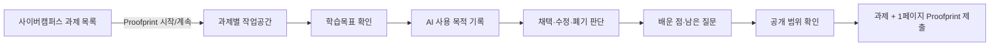

# CNU Proofprint × 사이버캠퍼스 접목안

작성일: 2026-08-25

## 결론

Proofprint를 별도 AI 채팅 서비스로 만들기보다 사이버캠퍼스의 `과제` 흐름에 붙는 학습 도구로 설계한다. 학생은 과제를 시작할 때 Proofprint 작업공간을 열고, 과제 수행 중에는 짧은 판단 체크포인트를 남기며, 제출 직전 1페이지 학습과정 기록의 공개 범위를 확인한다.

프로덕션에서는 사이버캠퍼스 화면을 복제하거나 로그인 쿠키를 읽지 않는다. 학교가 허용한 표준 연동 또는 공식 API를 통해 실행 컨텍스트만 전달받고, Proofprint는 별도의 격리된 애플리케이션으로 동작해야 한다.

## 실제 화면에서 확인한 구조

2026-08-25 학생 계정의 과목 화면을 읽기 전용으로 확인했다.

- 전역 상단: 강의실, To-Do-list, 알림마당, 사용자·알림 영역
- 과목 상단: 현재 학기와 과목명
- 좌측 학습요소: 강의수강, 콘텐츠, 자료실, 과제, 토론, 시험/퀴즈, 팀프로젝트
- 좌측 학습게시판: 공지사항, Q&A, 자유게시판, 설문조사
- 과제 목록: 검색, 주회차, 제목, 완료 여부, 취득점수 등
- 과제 상세 데이터가 없는 과목이어서 실제 제출 폼과 첨부파일 UI는 이번 조사에서 확인하지 못함

캡처 근거는 로컬 `.artifacts/cnu-audit/`에 보관한다. 로그인 계정 정보가 보일 수 있어 이 디렉터리는 Git에서 제외한다.

## 권장 사용자 흐름

## 현재 프론트엔드 프로토타입

선택한 CNU 시각안과 실제 사이버캠퍼스 구조를 기준으로 학생용 흐름을 다음 경로에 구현했다.

| 화면 | 경로 | 확인할 핵심 경험 |
| --- | --- | --- |
| 과제 대시보드 | `/` | 기존 과제 목록과 Proofprint 진행률을 한곳에서 확인 |
| 과제 상세 | `/assignments/ai-service-proposal` | 과제 지침·학습목표·AI 기록 원칙 확인 후 이어서 작성 |
| 5단계 작업공간 | `/assignments/ai-service-proposal/proofprint` | 학습목표 → AI 활용 → 판단 → 배운 점 → 제출 흐름 |
| 1페이지 결과 | `/assignments/ai-service-proposal/proofprint/result` | 공개 범위 조정, PDF 보기, LMS 제출 확인 |
| 제출 기록 | `/proofprints` | 작성 중·제출 완료 기록 검색과 재열람 |

현재 작업공간·제출 이력은 로컬 PostgreSQL에 저장된다. LMS 제출과 실제 학생 인증은 아직 데모 상태이며, 사이버캠퍼스 운영 서버나 실제 학생 데이터에는 쓰지 않는다.

### 1. 과제 목록

- 기존 과제 표에 `AI 학습과정` 상태를 추가한다.
- 상태 예시: `시작 전`, `3/5 체크포인트`, `제출 준비 완료`.
- 주요 동작은 `Proofprint 시작` 또는 `계속 작성` 하나만 둔다.

### 2. 과제 작업공간

- 과제명과 교수자가 설정한 학습목표를 자동으로 불러온다.
- 학생은 AI를 쓴 직후 `목적`, `채택·수정·폐기`, `이유`만 짧게 기록한다.
- Proofprint 안의 CNU 멀티LLM 패널에서 모델을 선택하고 질문한 뒤, 검토할 답변만 판단 단계로 가져올 수 있다.
- 전체 프롬프트·응답 복사를 요구하지 않는다.
- 현재 구현한 5단계 작업공간이 이 단계에 해당한다.

학교 AI 포털 연동의 현재 제약과 서버 커넥터 계약은 [`cnu-multillm-integration.md`](./cnu-multillm-integration.md)를 참고한다.

### 3. 제출 전 검토

- 체크포인트를 시간순으로 보여준다.
- 학생이 `판단과 이유`, `배운 점`, `남은 질문`, `원문`의 공개 여부를 직접 정한다.
- 기본값은 프롬프트·응답 원문 비공개다.
- 최종 제출물은 PDF 또는 LMS가 받을 수 있는 링크형 스냅샷으로 생성한다.

## 학교 생성형 AI 원칙과의 대응

`서약.md`의 학습자 체크리스트를 제품 요구사항으로 직접 연결한다.

| 학교 원칙 | Proofprint 기능 |
| --- | --- |
| 활용 기준 준수 | 과제마다 교수자의 허용·금지·표시 지침 노출 |
| 학습보조 활용 | AI 사용 목적을 학습목표와 연결 |
| 결과물 책무성 | 학생이 최종 판단 주체임을 체크포인트에 명시 |
| 사실 검증 | `근거 확인` 목적과 출처 확인 상태 제공 |
| 학문적 진실성 | 1페이지 기록에 AI 활용 범위와 생성 방식을 표시 |
| 자기주도적 활용 | 채택·수정·폐기와 판단 이유를 학생이 직접 작성 |
| 오남용 방지 | 과도한 AI 사용보다 판단·학습 변화 중심으로 요약 |

## 연동 수준별 실행안

### A. 파일럿: 링크형 연동

- 교수자가 과제 설명에 Proofprint 과제 링크를 넣는다.
- 학생은 학교 SSO 또는 임시 학교 이메일 인증으로 진입한다.
- 완성된 PDF를 기존 과제 첨부파일로 제출한다.
- 가장 빨리 검증할 수 있지만 과목·과제 정보를 중복 입력해야 한다.

### B. 권장: LTI 1.3 실행 연동

- 학교 LMS가 지원하면 LTI 1.3 Tool로 Proofprint를 등록한다.
- Launch 시 사용자 역할, 과목, 과제 컨텍스트를 서명된 토큰으로 전달받는다.
- Deep Linking을 사용하면 교수가 과제 안에 Proofprint 활동 링크를 배치할 수 있다.
- Names and Role Provisioning, Assignment and Grade Services는 파일럿 이후 필요한 범위만 단계적으로 검토한다.

[1EdTech의 LTI Advantage 구현 가이드](https://standards.1edtech.org/lti/guides/implementation_guide/implementation-guide)는 LTI 1.3 Core와 Deep Linking, Names and Role Provisioning, Assignment and Grade Services의 역할을 설명한다. 실제 적용 전에는 현재 사이버캠퍼스 제품과 운영기관이 어느 기능을 허용하는지 확인해야 한다.

### C. 공식 LMS API·플러그인 연동

- LTI 미지원 또는 화면 내 상태 표시가 꼭 필요할 때 검토한다.
- 과제 목록에 Proofprint 상태를 직접 넣으려면 LMS 공급사 플러그인 또는 공식 API 권한이 필요하다.
- 브라우저 확장 프로그램, DOM 삽입, 쿠키 재사용 방식은 운영 안정성과 개인정보 위험 때문에 파일럿의 기본안으로 사용하지 않는다.

## 교수자 화면의 최소 범위

- 과제 생성 시 학습목표와 AI 활용 지침 설정
- Proofprint 제출 필수·선택 설정
- 공개 가능한 필드 범위의 기본값 설정
- 제출된 1페이지 결과만 열람
- 학생의 미제출 초안과 비공개 원문은 열람 불가

## 다음 확인이 필요한 학교 측 질문

1. 사이버캠퍼스가 외부 LTI 1.3 Tool 등록을 지원하는가?
2. 과제 내부 iframe 실행과 외부 새 창 실행 중 허용 방식은 무엇인가?
3. 학교 SSO의 OIDC/SAML 연동을 외부 파일럿 서비스에 제공할 수 있는가?
4. 과제 제출물로 PDF 외에 외부 도구 링크를 허용하는가?
5. 학생 학습과정 데이터의 저장 위치와 보존기간 기준은 무엇인가?
6. 교수자가 볼 수 있는 학습과정 정보의 학교 공식 범위는 어디까지인가?

## 파일럿 성공 기준

- 체크포인트 1건 작성 중앙값 60초 이하
- 학생 과제 완료율 저하 없음
- 교수자 1명당 제출물 검토 시간 감소
- 교수자가 학생의 핵심 판단과 남은 질문을 이해할 수 있음
- 학생이 원치 않는 프롬프트·응답 원문 노출 0건
- AI 요약 내용의 모든 문장이 체크포인트 또는 학생 작성 문장에 근거함
